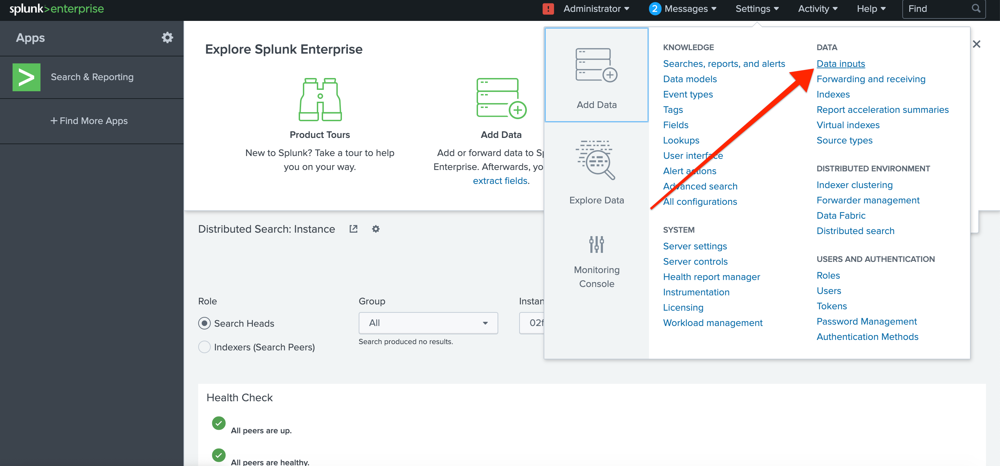
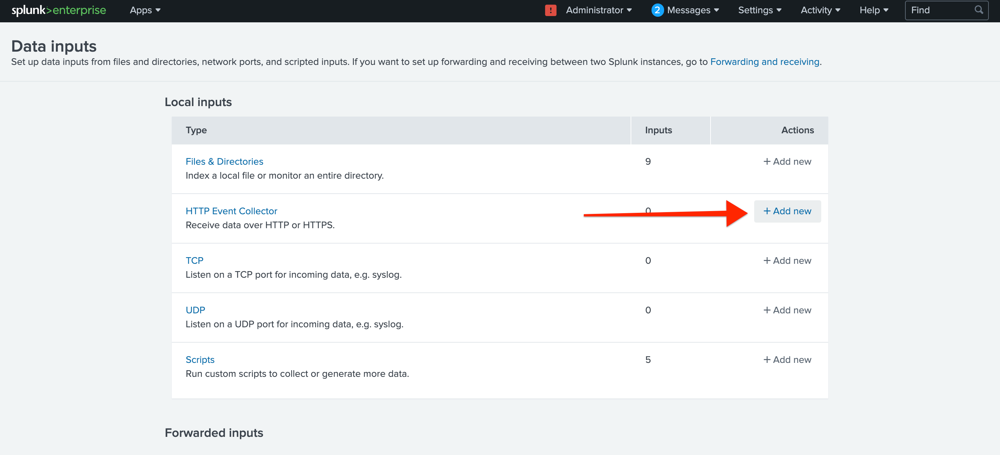
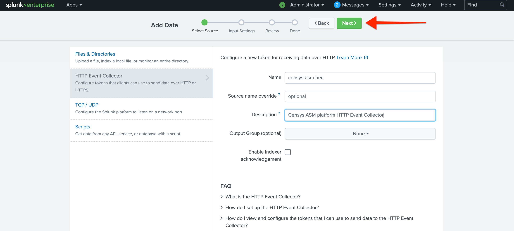
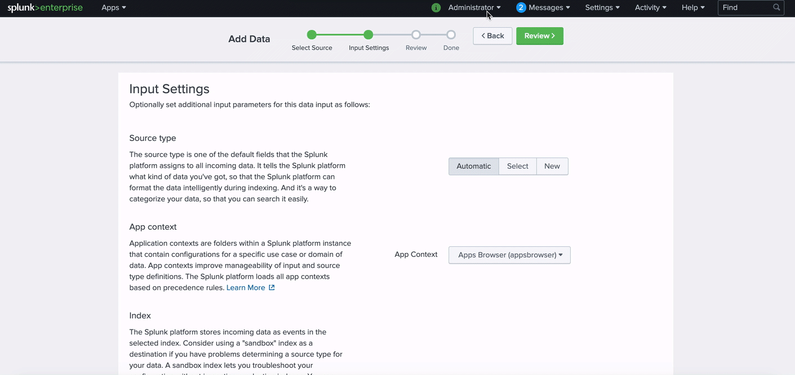
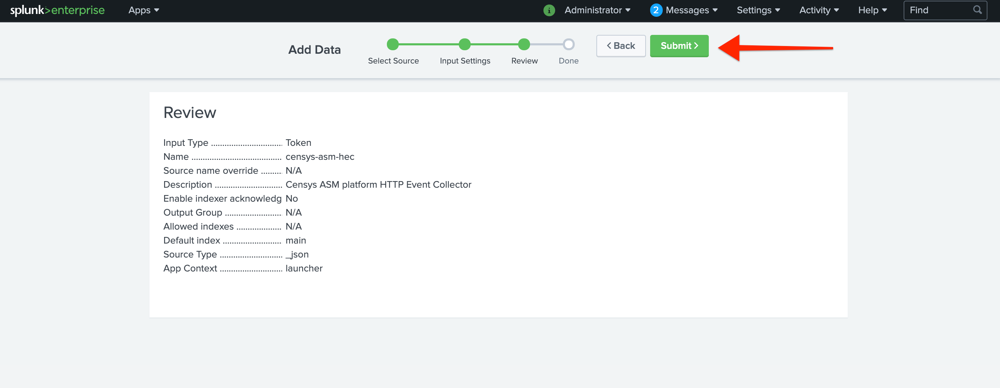
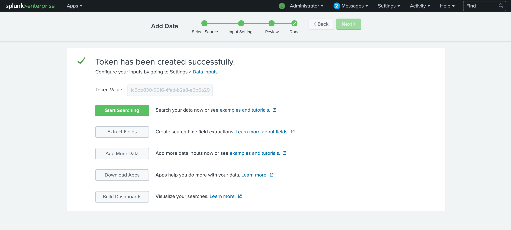
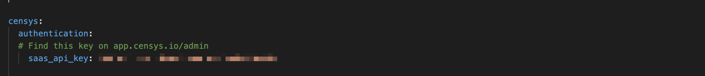
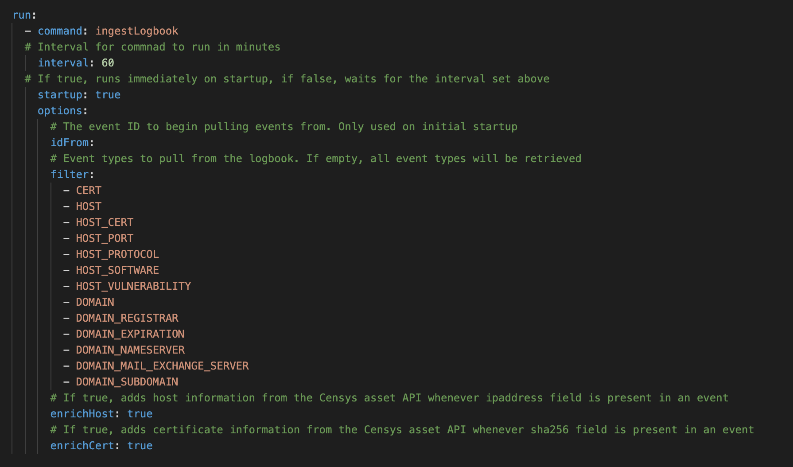
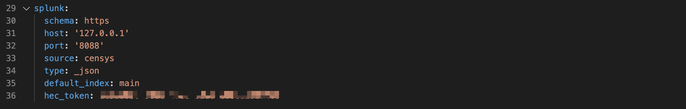
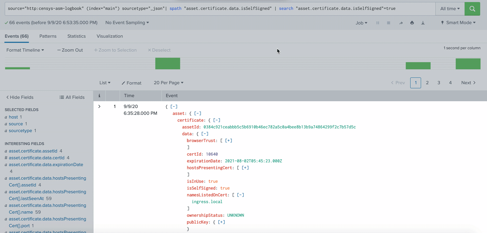

# Censys Splunk HTTP Event Collector Integration
v1.0, 2020-09-09
:toc: preamble
:toc-title: In this guide:

The Censys Splunk HEC integration sits between the Censys Attack Surface Management platform and your Splunk instance.

The integration queries the platform's logbook and asset APIs and feeds enriched events into Splunk's HTTP Event Collector.

## Installation Considerations

The Censys Splunk HEC integration is packaged to run in a Docker container, which can be deployed on a variety of infrastructure types. Managing containers is the responsibility of the the user. 

HTTP Event Collector runs on Splunk Enterprise, and self-service and managed Splunk Cloud. How it works depends on the type of Splunk instance you have.
For more information, see the link:https://docs.splunk.com/Documentation/Splunk/8.0.5/Data/UsetheHTTPEventCollector?ref=hk[Splunk documentation] for managing HEC in your instance.

## Create an HTTP Event Collector Data Input Token in Splunk

In your Splunk instance, click the *Settings* dropdown in the upper right of the nav bar. 
Underneath the Data section, click *Data Inputs*.

.Location of Data Inputs in menu

On the Data Inputs page, find the HTTP Event Collector row in the Local Inputs table, and click *+ Add New* in the right-hand column.

.Data Inputs page

There are three steps in the "Add Data" process:

. Select Source
. Input Settings
. Review

### Select Source

On the Select Source page, choose a name and description for the data input token you're going to generate.

.Select Source page

You can optionally choose to override the default value of the `source` field in the events. 
The default value is `censys`.

Then, click *Next*.

### Input Settings

On the Input Settings page, in the Source type section, click the *Select* option, and in the dropdown that appears, select the `_json` option.

Scroll down to the Index section: this setting determines the index where the events for this input should be stored.

To use the default index, leave the drop-down list set to Default, and select "main" from the list.

After you make your selections, click *Next* to proceed to review.

.Input Settings page

### Review Selection

On the final page, review your input settings and click *Submit*.

.Review page

### Confirmation 

After clicking *Submit*, you will see a confirmation page, with a token that was generated for this input.

.Confirmation page

This token will authorize the Censys Splunk HEC integration to send data to your Splunk instance.

## Set up the Censys Splunk HEC Integration

To set up the integration, you must:

. Create a settings.yaml file in the repo
. Build the docker container
. Run the application

### Create a settings file

To create the settings file, open the `settings_example.yaml` file in the repo and fill in the fields with the required information:

#### Authentication

In the `authentication` section, provide a value for the `saas_api_key` field by copying and pasting your API key from the link:https://app.censys.io/admin[admin page] in the app.

.Censys ASM platform authentication information

#### Run

In the `run` section, provide values for the following fields:

- `interval` - An interval for the command in minutes. Default is 60.

- `startup` - A boolean for whether to run the command immediately on startup (`true`) or wait the interval prescribed in `interval` (`false`).

- `idFrom` - The Censys logbook event ID to begin pulling events from at startup. Logbook event IDs increase sequentially from 1. If empty, all events will be pulled on startup.

- `filter` - A list of event types to pull from the logbook. If empty, all event types will be retrieved.

- `enrichHost` - A boolean for whether to add current host information from the asset API whenever an `ipAddress` field appears in an event.

- `enrichCert` - A boolean for whether to add certificate information from the asset API whenever a `sha256` field appears in an event.

.Censys ASM platform run information

#### Splunk

In the `splunk` section, provide values for the following fields:

- `schema`: The application-layer protocol. Should be `https`.

- `host`: The host where your splunk instance is located.

- `port`: The dedicated where your splunk instance is receiving HTTP input. The default Splunk value is `8088`.

- `source`: The value for the source field in the Splunk evnet. Should be `censys`.

- `type`: The value for the source type. Should be `_json`.

- `default_index`: The value for the default Splunk index to store this data in. Should be `main`.

- `hec_token`: The string generated when you created an HTTP Event Collector Data Input token.

.Censys ASM platform splunk information

#### Save Your File

After you've provided values for all of the fields in `settings_example.yaml`, save the file as `settings.yaml`.

### Build the docker container

Run the following command on your terminal:

....
./censys-splunk-hec.sh build
....

### Run the docker container

Run the following command:

....
./censys-splunk-hec.sh run
....

If you are testing, and only want to run the integration once, run the following command:

....
./censys-splunk-hec.sh once
....

## Search in Splunk

After the HEC integration begins sending Censys logbook events to Splunk, these events (enriched with asset information if enabled in the integrations settings file) are searchable in Splunk.

.Search Splunk for events

A full list of logbook event types can be found in our https://app.censys.io/docs/logbook-events/[product documentation], and asset entities can be viewed in our https://app.censys.io/api-docs[API documentation].

Happy Splunking!